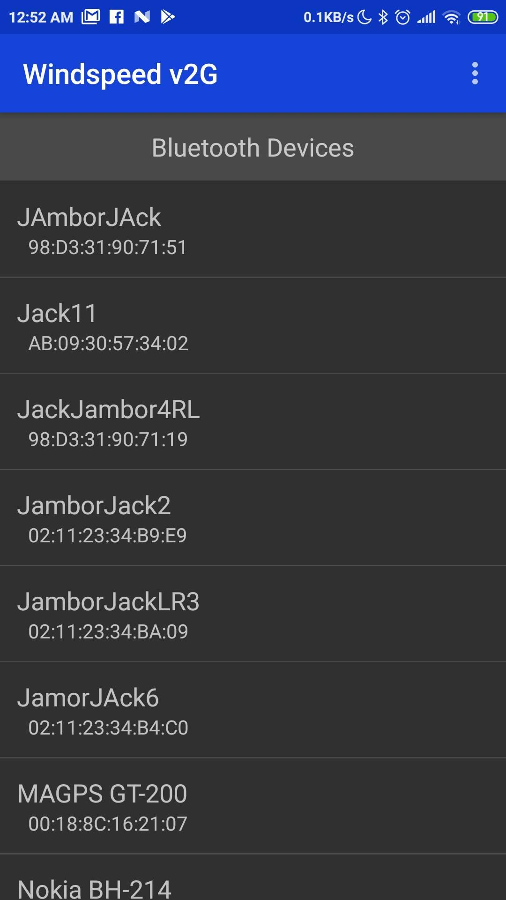
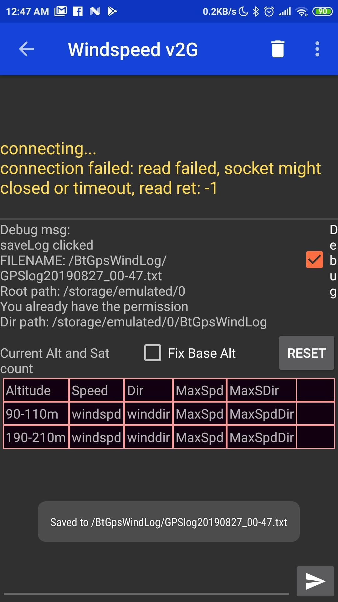

# WindSpeed Android App

Android Tool for on the fly windspeed measurement.
It receives NMEA sentences over BlueTooth and shows wind speed data.
The messages travel to a BT receiver through a long range serial radio pair.

Measurement are used for hot air ballon flights.

Current version is modified to collect data by a quadcopter and having the transmitter/GNSS module on the drone, lettign the drone drifting with the wind keeping altitude only each mat 100meters of altitude.

# Pictures of the page

 

 

## The Original App used here for BT2.0 serial communication:

[Serial Bluetooth Terminal](https://play.google.com/store/apps/details?id=de.kai_morich.serial_bluetooth_terminal) app.

This Android app provides a line-oriented terminal / console for classic Bluetooth (2.x) devices implementing the Bluetooth Serial Port Profile (SPP)

For an overview on Android Bluetooth communication see 
[Android Bluetooth Overview](https://developer.android.com/guide/topics/connectivity/bluetooth).

This App implements RFCOMM connection to the well-known SPP UUID 00001101-0000-1000-8000-00805F9B34FB

